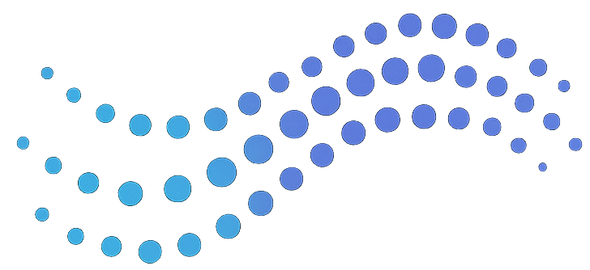

# Airless

Airless is a package that aims to build a serverless and lightweight orchestration platform, creating workflows of multiple tasks being executed on serverless functions. It is build to be Cloud agnostic, so using any Cloud provider is possible

* [Google Cloud Functions](https://cloud.google.com/functions)
* [AWS Lambda](https://aws.amazon.com/pm/lambda)
* [Azure Functions](https://learn.microsoft.com/en-us/azure/azure-functions/)

## Why not just use [Apache Airflow](https://airflow.apache.org/)?

Airflow is the industry standard when we talk about job orchestration and worflow management. However, in some cases, we believe it may not be the best solution. I would like to highlight 3 main cases we face that Airflow struggles to handle.

* Serverless

At the beginning of a project we want to avoid dealing with infrastructure since it demands time and it has a fixed cost to reserve an instance to run Airflow. Since we didn't have that many jobs, it didn't make sense to have an instance of Airflow up 24-7. 

When the project starts to get bigger and, if we use Airflow's instance to run the tasks, we start facing performance issues on the workflow.

In order to avoid this problems we decided to build a 100% serverless platform.

* Parallel processing

The main use case we designed Airless for is for data scrappers. The problem with data scrappers is that normally you want them to process a lot of tasks in parallel, for instance, first you want to fetch a website and collect all links in that page and send them forward for another task to be executed and then that task does the same and so on and so forth.

Building this workflow that does not know before hand how many tasks are going to be executed is something hard be built on Airflow.

* Data sharing between tasks

In order to built this massive parallel processing workflow that we explained on the previous topic, we need to be able to dynamically create and send data to the next task. So use the data from the first task as a trigger and an input data for the next tasks. 

## Architectural Decisions
- Event-Driven Architecture: Utilizes queues to decouple event producers and consumers. Or use HTTP when need synchronous workflows
- Scalability: Serverless scale automatically based on the number of incoming messages.

**Data Flow**
- Trigger: A message is published to a queue topic or an HTTP request is made.
- Cloud Function Invocation: The subscribed serverless service is triggered.
- Operator Execution: Processes the message using Airless operators.
- Data Storage/Forwarding: Uses hooks to store data in object stores, for example, or publish new messages to other queues.

**Performance Optimization**
- Efficient Data Handling: Use hooks to abstract and optimize interactions with external services.
- Resource Management: Configure appropriate memory and timeout settings in your serverless service.

**Security**
- Least Privilege: Assign the minimum required permissions to service accounts.
- Secret Management: Use secret manager to store sensitive information.

## How it works

Airless builts its workflows based on serverless functions, queues and schedulers. All of them serverless.

1. Everything starts with the scheduler, which is able to publish a message to a queue with a cron scheduler
2. When a message is published to the queue it can trigger a serverless function and get executed with that message as an input
3. This serverless function is able to publish as many messages as it wants to as many queue topics as it wants
4. Repeat from 2
