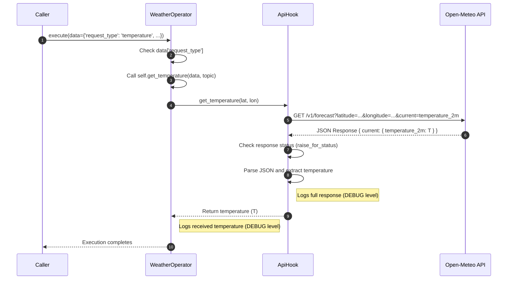

This quickstart guides you through installing the `airless-core` package, setting up a basic workflow that consult an api and log the response. This will running it locally either in the terminal.

This quickstart assumes a local IDE (VS Code, PyCharm, etc.) with Python 3.9+ and terminal access. This method runs the application entirely on your machine and is recommended for internal development.

## Set up Environment & Install airless needed packages

Create environment and install airless-core:

=== "uv"
    ```bash
    uv init --bare --no-workspace
    uv add airless-core
    ```

=== "pip + venv"
    ```bash
    python -m venv .venv
    # Activate venv in Mac / Linux
    source .venv/bin/activate
    # Windows CMD: .venv\Scripts\activate.bat
    # Windows PowerShell: .venv\Scripts\Activate.ps1
    pip install airless-core
    ```

## Project Structure

You will need to create the following structure:

```text
.
├── hook
│   └── api.py
├── operator
│   └── weather.py
├── pyproject.toml
├── Makefile
└── .env
```

Create the hook and operator folders like this

```bash
mkdir hook operator
```

In `.env` file you need to add the following env vars
!!! Note
    If you're using uv you can pass the `.env` file when executing the code using the following code `uv run --env-file .env python ...`.
    If you're not using uv you can export this variables to you're current terminal session.

### Workflow Sequence Diagram

The interaction between the components when running the `make run` command follows this sequence:



**Explanation of the Diagram Steps:**

1.  **Caller -> WeatherOperator: execute(...)**
    An external system or caller invokes the `execute` method of an existing `WeatherOperator` instance (defined in `operator/weather.py`), providing the necessary data payload. When the `WeatherOperator` was instantiated (outside this sequence), it also created an instance of `ApiHook` (from `hook/api.py`).
2.  **WeatherOperator -> WeatherOperator: Check data['request_type']**
    Inside the `execute` method, the operator examines the `request_type` field within the provided `data` dictionary to decide the next action.
3.  **WeatherOperator -> WeatherOperator: Call self.get_temperature(data, topic)**
    As the `request_type` is 'temperature', the `execute` method proceeds to call the operator's own `get_temperature` method, passing the data.
4.  **WeatherOperator -> ApiHook: get_temperature(lat, lon)**
    The operator's `get_temperature` method retrieves the latitude (`lat`) and longitude (`lon`) from the data and invokes the `get_temperature` method on its associated `ApiHook` instance.
5.  **ApiHook -> Open-Meteo API: GET /v1/forecast...**
    The `ApiHook` formulates the request parameters and dispatches an HTTP GET request to the Open-Meteo API endpoint via the `requests` library, aiming to retrieve the current temperature for the specified coordinates.
6.  **Open-Meteo API -->> ApiHook: JSON Response {...}**
    The Open-Meteo API fulfills the request and returns a JSON formatted response containing the weather details, including the temperature data.
7.  **ApiHook -> ApiHook: Check response status (raise_for_status)**
    The hook validates the HTTP response status. If it indicates an error (e.g., 4xx or 5xx status code), an exception is raised. Otherwise, processing continues.
8.  **ApiHook -> ApiHook: Parse JSON and extract temperature**
    The hook processes the successful JSON response, navigating its structure to isolate the specific temperature value (`temperature_2m`). The complete response is also logged at the DEBUG level for diagnostics.
9.  **ApiHook -->> WeatherOperator: Return temperature (T)**
    The extracted temperature value is sent back as the return value from `ApiHook.get_temperature` to the waiting `WeatherOperator`.
10. **WeatherOperator: Logs received temperature (DEBUG level)**
    Upon receiving the temperature from the hook, the `WeatherOperator.get_temperature` method logs this value using its configured logger.
11. **WeatherOperator -->> Caller: Execution completes**
    With the temperature fetched and logged, the `get_temperature` and subsequently the `execute` methods complete their execution, returning control flow back to the original `Caller`.


## hook.py

We will use the [open-meteo](https://open-meteo.com/) api to get the current weather giving a latitude and longitude.

```python title="hook/api.py"
import requests

from airless.core.hook import BaseHook


class ApiHook(BaseHook):# (1)!
    """A simple hook to simulate fetching weather data."""

    def __init__(self):
        """Initializes the WeatherApiHook."""
        super().__init__()
        self.base_url = 'https://api.open-meteo.com/v1/forecast'

    def get_temperature(self, lat: float, lon: float) -> float:
        """
        Fetch the current temperature for a given city.

        Args:
            lat (float): The latitude of the city.
            lon (float): The longitude of the city.

        Returns:
            float: The current temperature in Celsius.

        Raises:
            ValueError: If the latitude or longitude is empty or invalid.
        """
        params = {
            'latitude': lat,
            'longitude': lon,
            'current': 'temperature_2m' 
        }
        with requests.Session() as session:# (2)!
            response = session.get(
                self.base_url,
                params=params
            )
            response.raise_for_status()# (3)!
            data = response.json()
            self.logger.debug(f"Response: {data}")

            temperature = data['current']['temperature_2m']

            return temperature
```

1. To create a hook you need to inherit from `#!python BaseHook`
2. Use `#!python requests.Session()` to ensure that the session is closed after the request, to avoid memory leaks.
3. Use `#!python response.raise_for_status()` to raise an exception if the request was not successful. Depends on the use case, is better to raise an exception so can be caught, retried and handled by the operator or by the airless error function.

## operator.py

Now we will create a operator that will use the hook we just created.
```python title="operator/weather.py"

from airless.core.operator import BaseOperator

from hook.api import ApiHook


class WeatherOperator(BaseOperator):# (1)!
    """A simple operator to simulate fetching weather data."""

    def __init__(self):
        """Initializes the WeatherOperator."""
        super().__init__()
        self.api_hook = ApiHook()

    def execute(self, data: dict, topic: str) -> None:
        """Define which method to call based on the request type."""
        request_type = data['request_type'] # (2)!

        if request_type == 'temperature':
            self.get_temperature(data, topic)
        else:
            raise Exception(f'Request type {request_type} not implemented')

    def get_temperature(self, data: dict, topic: str) -> None:
        """Fetch the current temperature for a given city."""
        lat = data['lat']
        lon = data['lon']
        temperature = self.api_hook.get_temperature(lat, lon)

        self.logger.debug(f"Temperature: {temperature}") # (3)!
```

1. To create an operator you need to inherit from `#!python BaseOperator`
2. In general, in execute method you need to define which method to call based on the request type.
3. `#!python BaseOperator` has a built-in `#!python self.logger` to log messages.

## Makefile and .env
In the root directory create a `Makefile` and a `.env` file.

First, to create the files run the command:
```bash
touch Makefile .env
```

In the `Makefile` add the following code:

??? Warning
    Makefile identation is tab not spaces

```bash
run:
    @python -c "from operator.weather import WeatherOperator; WeatherOperator().execute(request={'data': {'request_type': 'temperature', 'lat': 40.7128, 'lon': -74.0060}})"
```

??? Example "Exporting environment variables in Makefile"
    If you want you can export your environment variables in the Makefile. But it's not recommended.

    Just need to write like the following code:
    ```bash
    export ENV=dev
    export LOG_LEVEL=DEBUG

    run:
	    @python -c "from operator.weather import WeatherOperator; WeatherOperator().execute(request={'data': {'request_type': 'temperature', 'lat': 40.7128, 'lon': -74.0060}})"
    ```

In `.env` add the following environment variables:

```env
ENV=dev
LOG_LEVEL=DEBUG
```

## Run

To run the operator you just need to execute the following command:

```bash
uv run --env-file .env make run
```
